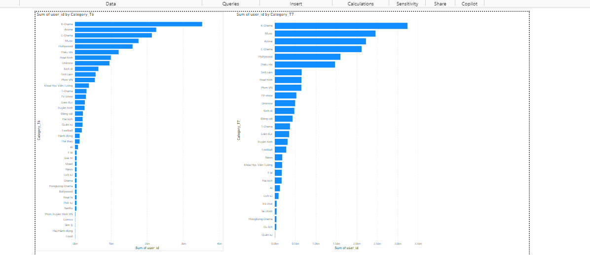

# User Search Pipeline

## Overview

The User Search Pipeline project is designed to process and analyze user search data stored in Parquet format. It utilizes Apache Spark for distributed data processing and Python for scripting and data manipulation tasks.

## Project Structure

The project is organized into the following main components:

```bash
    root
    |-- main.py
    |-- job/
    |   |-- __init__.py
    |   |-- data_processing.py
    |-- data/
    |   |-- (input Parquet files)
    |-- output/
    |   |-- (output CSV files)
    |-- .env
    |-- requirements.txt
```

- **main.py**: Contains the main script to orchestrate the data pipeline.
- **job/**: Directory containing scripts and modules related to data processing.
- **data/**: Directory where input Parquet files are stored.
- **output/**: Directory where output files (such as CSV files) are stored.

## Data Schemma

Root

```bash
|-- eventID: string (nullable = true)
|-- datetime: string (nullable = true)
|-- user_id: string (nullable = true)
|-- keyword: string (nullable = true)
|-- category: string (nullable = true)
|-- proxy_isp: string (nullable = true)
|-- platform: string (nullable = true)
|-- networkType: string (nullable = true)
|-- action: string (nullable = true)
|-- userPlansMap: array (nullable = true)
|    |-- element: string (containsNull = true)
```

Output

```bash
|-- user_id: string (nullable = true)
|-- most_search_t6: string (nullable = true)
|-- most_search_t7: string (nullable = true)

```

## Integration with Power BI

Data Extraction:

Use the processed CSV files from the output/ directory for data visualization.
Connect to Data:

In Power BI, use the "Get Data" feature to import data from CSV files.
Create Visualizations:

Design dashboards and reports in Power BI using imported data.
Utilize features like filters, slicers, and charts to analyze user search trends.
Schedule Refresh (optional):

Configure scheduled data refresh in Power BI to automatically update reports with new data from your pipeline.


## Requirements

To run this project, ensure you have the following dependencies installed:

- Python (>= 3.x)
- Apache Spark
- PySpark
- pandas
- findspark
- dotenv

Install Python dependencies using `pip`:

```bash
pip install findspark pyspark pandas python-dotenv
```
